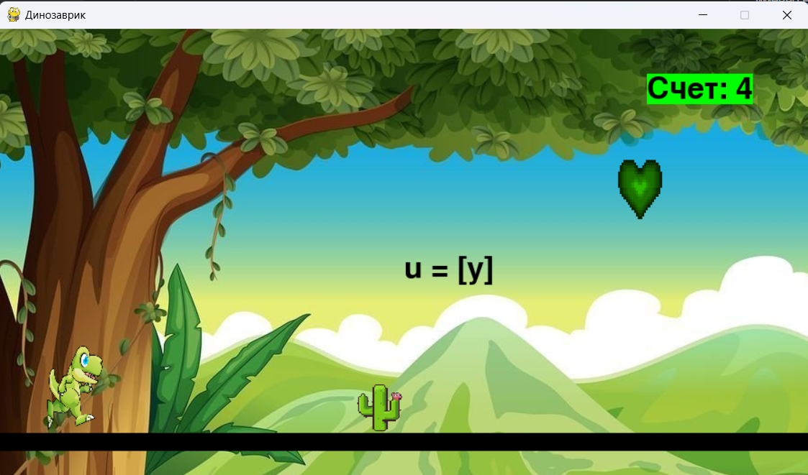

# Динозаврик
## Описание
Игра **Динозаврик** позволит быстрее освоить начальные знания ***итальянского языка***, а именно его ***алфавит***.
В ходе игры, как только пользователь, играющий в так называемую *"бегалку"* за динозавра, преодолевает препятствие (кактус),
тем самым зарабатывает **очки** и запоминает ***написание*** и ***произношение*** изучаемых букв.
Испанский язык считается одним из самым легких языков, ведь в нем всего 21 буква.
По истечении определенного промежутка времени, игра *ускоряется*.
Игра имеет приятный дизайн и музыкальное сопровождение. В будущем планируется добавить уровни, чтобы пользователи смогли не только изучить алфавит, но и простые слога, слова.

Код написан на языке Python, с помощью модуля Pygame.
## Запуск игры
1. Создайте виртуальное окружение

```python -m venv .venv```

2. Активировать виртульное окружение.
3. Установите библиотеку, используя в терминале следующую команду:

```pip install pygame```

Также, приложение собрано для запуска через .exe файл.